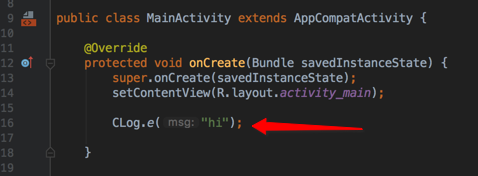
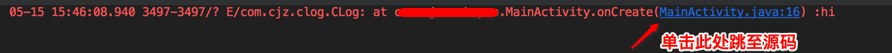

# CLog
一个Android日志辅助工具,可在IDE中控制台单击日志快速跳转到所在代码处,支持Android Studio 和Eclipse.

## 如图

### 支持

- 支持单击控制台日志跳转源码
- 支持按小时输出日志
- 支持按tag输出日志
- 异步输出,不影响日志调用处的性能

### 说明
 增加日志写文件操作,默认写入到以当前时间yyyy-MM-dd_HH.txt命名的 *主日志* 文件中.

1. *CLog.f( )* 用于将日志写入文件,主日志文件.
2. *CLog.fTagAsLogFileName( )* 用于提取某个tag的日志,并将日志写入以Tag前缀+时间命名的文件中.
3. *CLog.vt( )* 用于输出打印日志时当前所处线程信息.

---
- 如果需要支持eclipse,请打开对应代码的注释
- 更多优化待续...
